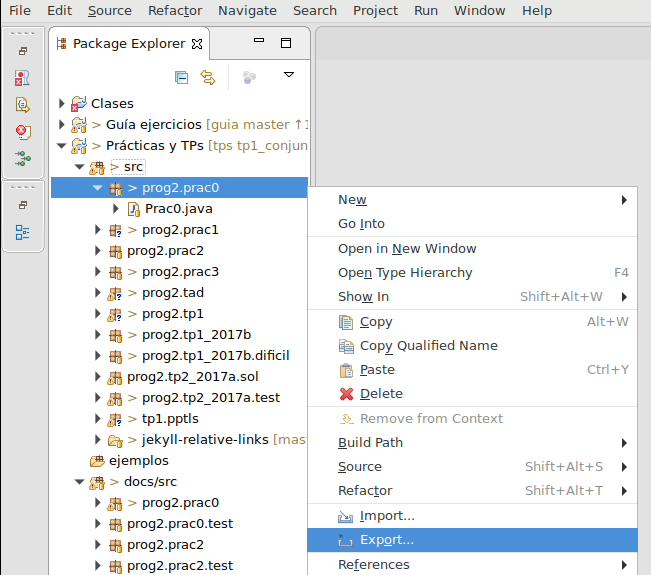
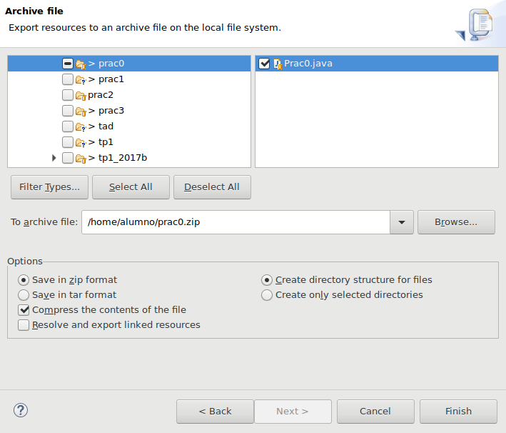

# Entrega de TPs

Todos las entregas se realizan por correo electrónico a la dirección de la materia: `ungs.programacion2@gmail.com`.

Todas las entregas constan de _uno o dos_ archivos adjuntos:

  1. un archivo **ZIP** con el código

  2. un informe en formato **PDF** (solo si lo pide la consigna)

El archivo ZIP debe contener todos los archivos _.java_ que compongan la entrega, sin ningún código compilado _(\*.class)_ ni bibliotecas _(\*.jar)_.

Se puede usar la funcionalidad _Export_ de Eclipse para crear el archivo a enviar. Lo más expeditivo es exportar el _paquete_ que contiene el código, haciendo click secundario en el nombre del paquete y la opción _Export → General → Archive:_

